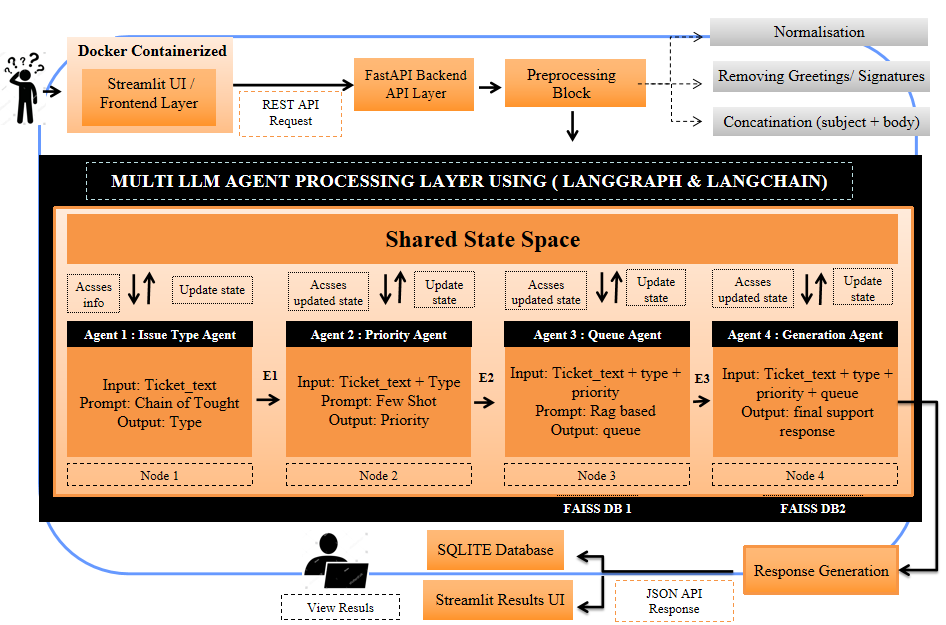
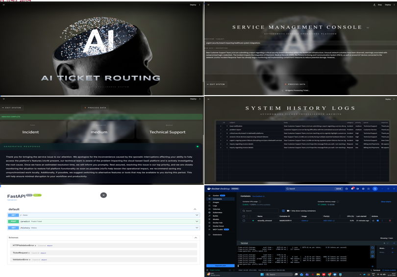

<div align="center">

# A Multi-Agent Generative AI Framework for Intelligent Customer Support Ticket Resolution using LangChain & LangGraph

<p align="center">


</p>

### 🎓 M.Tech Dissertation Project • Amrita Vishwa Vidyapeetham

**Department of Data Science**

**Author:** Siva Jyothis

**Guide:** Dr. Suja P.

---

### 🚀 Intelligent • Modular • Explainable • Privacy-Preserving

</div>

---

# 📖 Project Overview

Customer support centers receive thousands of support requests every day, ranging from billing inquiries and technical issues to product support and service outages. Efficient ticket handling requires understanding user intent, estimating urgency, routing tickets to the appropriate department, and generating accurate responses.

Traditional machine learning pipelines generally treat ticket processing as a single classification problem, while centralized Large Language Model (LLM) systems attempt to solve all tasks using one monolithic model. These approaches often suffer from limited interpretability, reduced modularity, and inconsistent decision-making across complex workflows.

This project introduces a **Multi-Agent Generative AI Framework** that decomposes customer support ticket resolution into a sequence of specialized reasoning tasks. Instead of relying on one large model to perform every operation, multiple LLM-powered agents collaboratively process each support ticket through a structured LangGraph workflow.

The proposed framework combines **LangGraph**, **LangChain**, **Retrieval-Augmented Generation (RAG)**, **FAISS Vector Search**, **FastAPI**, **Streamlit**, and **local Large Language Models (Mistral, LLaMA-2, and Phi-3)** to build a fully automated, privacy-preserving customer support ticket automation system.

The framework performs end-to-end ticket processing by:

- Classifying ticket type
- Predicting priority level
- Determining the appropriate routing queue
- Generating professional context-aware support responses
- Maintaining complete ticket history using SQLite
- Providing an interactive real-time Streamlit interface

Unlike cloud-based AI services, the complete system operates **entirely on local hardware**, ensuring enhanced privacy, lower operational costs, and full control over sensitive customer information.

---

# 🎯 Motivation

Modern enterprises depend heavily on customer support systems to manage user issues efficiently. As organizations grow, the volume and complexity of support tickets increase dramatically, making manual ticket triage expensive, time-consuming, and inconsistent.

Existing automation approaches exhibit several limitations:

- Traditional machine learning models focus only on single-task classification.
- Rule-based systems cannot adapt to diverse user expressions.
- Centralized LLM architectures attempt to solve multiple tasks simultaneously, reducing transparency and explainability.
- Existing chatbot systems prioritize response generation but lack structured reasoning for classification, prioritization, and routing.

To address these challenges, this project proposes a **modular Multi-Agent AI architecture** in which specialized language models collaborate through a deterministic LangGraph workflow. Each agent is responsible for a well-defined reasoning task while sharing contextual information through a common state representation.

This architecture improves:

- Decision transparency
- Modularity
- Scalability
- Explainability
- Response quality
- Semantic reasoning
- Retrieval accuracy
- Deployment flexibility

---

# ✨ Key Features

## 🤖 Multi-Agent AI Architecture

- Sequential LangGraph workflow
- Specialized LLM agents
- Shared state management
- Deterministic execution pipeline

---

## 🧠 Multiple Local Large Language Models

Supports multiple lightweight local models:

- Mistral 7B Instruct
- LLaMA 2 7B Chat
- Phi-3 Mini 4K Instruct

No cloud APIs are required.

---

## 🔍 Retrieval-Augmented Generation (RAG)

Uses semantic retrieval to improve:

- Queue prediction
- Response generation

Technologies:

- Sentence Transformers
- FAISS Vector Database
- Similar ticket retrieval
- Context-aware prompting

---

## ⚙️ LangGraph Workflow

The complete workflow is orchestrated using LangGraph.

Each agent receives the updated state from the previous agent before performing its reasoning task.

```
Ticket
   │
   ▼
Type Agent
   │
   ▼
Priority Agent
   │
   ▼
Queue Agent
   │
   ▼
Response Agent
   │
   ▼
Final Ticket Resolution
```

---

## 🌐 REST API Backend

Developed using **FastAPI**.

Provides REST endpoints for:

- Ticket Prediction
- Ticket History
- System Status

---

## 🎨 Interactive Streamlit Frontend

Provides:

- Modern user interface
- Real-time AI prediction
- Dynamic visualization
- Ticket history
- Professional response display

---

## 🗄️ Persistent Ticket History

Every processed ticket is automatically stored in SQLite, including:

- Subject
- Description
- Type
- Priority
- Queue
- Generated Response
- Timestamp

---

## 🐳 Docker Support

The Streamlit frontend is fully containerized using Docker, enabling:

- Cross-platform deployment
- Dependency isolation
- Reproducible environments
- Simplified installation

---

## 🔒 Privacy-Preserving AI

Unlike commercial cloud-based LLM services, this project performs all inference locally.

Benefits include:

- No external API calls
- Data privacy
- Lower operational cost
- Offline deployment capability
- Full control over AI models

---

# 🏗️ System Architecture

The proposed framework adopts a **sequential Multi-Agent Generative AI architecture** in which multiple specialized Large Language Models (LLMs) collaboratively process customer support tickets. Rather than relying on a single centralized model, each agent performs a dedicated reasoning task while sharing information through a common state representation managed by **LangGraph**.

The architecture integrates natural language understanding, semantic retrieval, structured decision-making, and response generation into a unified end-to-end intelligent ticket automation system.

<p align="center">

</p>

The architecture consists of the following major layers:

- **Input & Preprocessing Layer**
- **Multi-Agent Decision Layer**
- **Prompt Engineering Layer**
- **LangGraph Workflow Orchestration**
- **Retrieval-Augmented Generation (RAG)**
- **FastAPI Backend**
- **SQLite Database**
- **Streamlit Frontend**
- **Docker Deployment**

---

# ⚙️ End-to-End Workflow

The entire ticket resolution pipeline follows a deterministic feed-forward execution workflow.

```text
Customer Ticket
        │
        ▼
──────────────────────────────────
 Input & Preprocessing Module
──────────────────────────────────
        │
        ▼
Type Classification Agent
        │
        ▼
Priority Prediction Agent
        │
        ▼
Queue Routing Agent
        │
        ▼
Response Generation Agent
        │
        ▼
SQLite Database
        │
        ▼
FastAPI REST API
        │
        ▼
Streamlit User Interface
```

Each agent receives the updated ticket state from the previous agent, ensuring that downstream decisions benefit from earlier predictions.

---

# 🤖 Multi-Agent Workflow

The proposed framework utilizes **LangGraph** to orchestrate four independent AI agents into a unified workflow.

Each agent focuses on a single task while sharing contextual information through a common **TicketState** object.

---

## 🟢 Agent 1 — Issue Type Agent

### Purpose

Predict the category of the incoming support ticket.

### Input

- Ticket Subject
- Ticket Description

### Output

One of the predefined ticket categories:

- Incident
- Problem
- Request
- Change

### Prompt Strategy

- Few-Shot Prompting
- Label-constrained prediction
- Instruction-following

---

## 🟡 Agent 2 — Priority Prediction Agent

### Purpose

Estimate the urgency level of the support ticket.

### Input

- Ticket Text
- Predicted Ticket Type

### Output

- High
- Medium
- Low

### Prompt Strategy

- Chain-of-Thought Prompting
- Business impact reasoning
- Severity analysis

---

## 🔵 Agent 3 — Queue Routing Agent

### Purpose

Predict the department responsible for resolving the ticket.

### Input

- Ticket Text
- Ticket Type
- Priority

### Output

One of the organizational queues.

Examples include:

- Technical Support
- Product Support
- Billing & Payments
- Customer Service
- Human Resources
- IT Support
- Sales & Pre-Sales
- General Inquiry

### Prompt Strategy

Retrieval-Augmented Generation (RAG)

Uses:

- Sentence Transformers
- FAISS Vector Search
- Similar historical tickets

---

## 🟣 Agent 4 — Response Generation Agent

### Purpose

Generate a professional customer support response.

### Input

- Ticket Text
- Ticket Type
- Priority
- Queue

### Output

A complete context-aware response suitable for customer support.

The response generation module leverages:

- LangChain
- Local LLMs
- RAG
- Retrieved examples
- Prompt engineering

---

# 🧠 LangGraph State Management

Instead of treating each prediction independently, the framework maintains a shared **TicketState** object throughout the workflow.

The shared state contains:

```python
TicketState

ticket_text

ticket_type

priority

queue

generated_response
```

Each agent updates the shared state before passing it to the next node.

Benefits include:

- Context preservation
- Modular reasoning
- Transparent execution
- Explainable predictions
- Sequential decision making

---

# 🔍 Retrieval-Augmented Generation (RAG)

To improve routing accuracy and response generation quality, the framework integrates **Retrieval-Augmented Generation (RAG)**.

Instead of relying only on the LLM's internal knowledge, the system retrieves semantically similar historical tickets before generating predictions.

## Retrieval Pipeline

```text
Incoming Ticket
       │
       ▼
Sentence Embeddings
       │
       ▼
FAISS Vector Search
       │
       ▼
Top-K Similar Tickets
       │
       ▼
Prompt Construction
       │
       ▼
LLM Prediction
```

This approach significantly improves:

- Queue prediction
- Response quality
- Context awareness
- Generalization to unseen tickets

---

# 🛠️ Technology Stack

| Category | Technologies |
|-----------|--------------|
| Programming Language | Python |
| Backend | FastAPI |
| Frontend | Streamlit |
| Multi-Agent Framework | LangGraph |
| LLM Framework | LangChain |
| Vector Database | FAISS |
| Embeddings | Sentence Transformers |
| Database | SQLite |
| Deployment | Docker |
| Local LLM Runtime | llama.cpp |
| Version Control | Git & GitHub |

---

# 📊 Dataset

The project utilizes the **Customer Support Tickets Dataset** from Hugging Face.

### Dataset Source

**Dataset:** Tobi-Bueck/customer-support-tickets

The original dataset contains over **61,000 real-world customer support tickets** covering multiple support domains.

For experimentation and evaluation, a curated subset was prepared.

### Dataset Statistics

| Attribute | Value |
|-----------|------:|
| Number of Samples | 400 |
| Number of Features | 16 |
| Average Ticket Length | 70 Words |
| Total Characters | 197,982 |
| Ticket Categories | 4 |
| Priority Levels | 3 |
| Queue Classes | 10 |

Each ticket contains:

- Subject
- Description
- Issue Type
- Priority
- Queue
- Human-written Answer

These labels enable supervised evaluation of all four AI agents.

---

# 🤖 Large Language Models

The framework evaluates multiple open-source quantized LLMs.

| Model | Parameters | Role |
|--------|-----------:|------|
| Mistral 7B (Q4_K_M) | 7B | Type Classification |
| LLaMA 2-7B Chat (Q4_K_M) | 7B | Response Generation |
| Phi-3 Mini 4K Instruct | 3.8B | Priority & Queue Prediction |

These models provide efficient local inference without requiring cloud APIs or fine-tuning.

---

# 📥 Download Models & Dataset

Due to GitHub file size limitations, the datasets and pretrained GGUF models are hosted separately.

## Google Drive

**Project Resources**

https://drive.google.com/drive/folders/1sk8tavBx92d0UWfWY3iKxo10N6Isg1b_

---

### Dataset Directory

```text
data/

dataset_raw_400.csv

hf_dataset_final_train.csv
```

---

### Models Directory

```text
models/

mistral.Q4_K_M.gguf

llama-2-7b-chat.Q4_K_M.gguf

Phi-3-mini-4k-instruct-q4.gguf
```

After downloading, place the files into their corresponding folders before running the project.

---

# 📂 Repository Structure

```text
Multi-Agent-AI-Ticket-Automation/
│
├── backend/
│   ├── api.py
│   ├── database.py
│   └── pipeline.py
│
├── ui/
│   ├── ui.py
│   ├── assets/
│   └── pages/
│       └── history.py
│
├── data/
│   └── README.md
│
├── models/
│   └── README.md
│
├── docs/
│   └── Report.pdf
│
├── figures/
│   ├── architecture.png
│   ├── workflow.png
│   └── UI.png
│
├── Dockerfile.ui
├── requirements.txt
├── README.md
├── LICENSE
└── .gitignore
```

---

# ⚙️ Installation

## 1️⃣ Clone the Repository

```bash
git clone https://github.com/Sivajyothis2002/Multi-Agent-AI-Ticket-Automation.git

cd Multi-Agent-AI-Ticket-Automation
```

---

## 2️⃣ Create Virtual Environment

### Windows

```bash
python -m venv venv

venv\Scripts\activate
```

### Linux / macOS

```bash
python3 -m venv venv

source venv/bin/activate
```

---

## 3️⃣ Install Dependencies

```bash
pip install -r requirements.txt
```

---

## 4️⃣ Download Required Files

Download the required resources from the Google Drive folder.

### Google Drive

https://drive.google.com/drive/folders/1sk8tavBx92d0UWfWY3iKxo10N6Isg1b_

After downloading, organize the project as follows.

```text
data/

dataset_raw_400.csv

hf_dataset_final_train.csv

models/

mistral.Q4_K_M.gguf

llama-2-7b-chat.Q4_K_M.gguf

Phi-3-mini-4k-instruct-q4.gguf
```

---

# 🚀 Running the Project

The application consists of two major components:

- FastAPI Backend
- Streamlit Frontend

The backend must be started before launching the frontend.

---

# ▶️ Start FastAPI Backend

Navigate to the backend directory.

```bash
cd backend
```

Run the API server.

```bash
uvicorn api:app --reload
```

The backend will start at

```
http://localhost:8000
```

---

# ▶️ Start Streamlit Frontend

Open a new terminal.

Navigate to the UI directory.

```bash
cd ui
```

Launch the Streamlit application.

```bash
streamlit run ui.py
```

The application will open automatically in your browser.

```
http://localhost:8501
```

---

# 🐳 Docker Deployment

The frontend application is fully containerized using Docker.

## Build Docker Image

```bash
docker build -f Dockerfile.ui -t ticket-ai-ui .
```

---

## Run Docker Container

```bash
docker run -p 8501:8501 ticket-ai-ui
```

The Streamlit interface will be available at

```
http://localhost:8501
```

---

# 🌐 REST API Endpoints

The backend exposes REST APIs for real-time interaction.

| Endpoint | Method | Description |
|-----------|--------|-------------|
| `/` | GET | API Health Check |
| `/predict` | POST | Process Support Ticket |
| `/history` | GET | Retrieve Ticket History |

---

## Example Prediction Request

```json
{
    "subject": "Unable to login",
    "description": "I cannot access my account after resetting my password."
}
```

---

## Example Prediction Response

```json
{
    "type": "Incident",
    "priority": "High",
    "queue": "Technical Support",
    "response": "Please clear your browser cache and reset your password using the recovery link. If the issue persists, our technical support team has been notified."
}
```

---

# 💻 User Interface

The project provides an interactive web application developed using **Streamlit** for real-time customer support ticket analysis.

The interface allows users to:

- Submit customer support tickets
- Predict ticket category
- Estimate priority level
- Route tickets to the correct support queue
- Generate AI-powered responses
- View historical ticket logs
- Interact with the complete multi-agent pipeline

---

# 🏠 Main Dashboard

<p align="center">

</p>

The main dashboard provides a clean and intuitive interface for entering customer support tickets.

Users can submit:

- Ticket Subject
- Ticket Description

The application automatically processes the request using the LangGraph-based Multi-Agent workflow and displays structured AI predictions in real time.

---

# 📜 Ticket History Dashboard

<p align="center">

</p>

The History page retrieves all previously processed tickets from the SQLite database.

Each record includes:

- Ticket Subject
- Ticket Description
- Predicted Type
- Priority
- Queue
- AI Response
- Timestamp

This enables administrators to monitor historical AI decisions and audit the complete ticket processing workflow.

---

# 🔄 Complete Processing Workflow

The complete execution pipeline is summarized below.

```text
Customer Ticket
      │
      ▼
Input Preprocessing
      │
      ▼
Type Classification Agent
      │
      ▼
Priority Prediction Agent
      │
      ▼
Queue Routing Agent
      │
      ▼
Response Generation Agent
      │
      ▼
SQLite Storage
      │
      ▼
FastAPI REST API
      │
      ▼
Streamlit Dashboard
```

The modular architecture allows each agent to specialize in a single task while maintaining a shared contextual state across the entire workflow.

---

# 📈 Experimental Evaluation

The proposed framework was evaluated using a curated subset of the **Customer Support Tickets Dataset**, containing 400 manually verified support tickets spanning multiple issue categories, priority levels, and routing queues.

The experiments were designed to evaluate both **structured prediction performance** and **response generation quality** across different combinations of open-source Large Language Models.

The evaluation focused on four major tasks:

- Ticket Type Classification
- Priority Prediction
- Queue Routing
- Response Generation

The proposed Multi-Agent framework was compared against a centralized single-LLM pipeline to measure the effectiveness of task decomposition and sequential reasoning.

---

# 📊 Evaluation Metrics

## Classification Metrics

The following supervised metrics were used to evaluate the prediction agents.

| Metric | Description |
|---------|-------------|
| Accuracy | Overall prediction correctness |
| Precision | Correct positive predictions |
| Recall | Ability to retrieve relevant classes |
| F1-Score | Balance between Precision and Recall |
| Macro F1 | Equal-weighted average F1 across classes |
| Weighted F1 | Class-frequency weighted F1 |

---

## Response Generation Metrics

Generated responses were compared against the ground-truth human responses using semantic evaluation metrics.

| Metric | Description |
|---------|-------------|
| BERTScore F1 | Semantic similarity using contextual embeddings |
| Semantic Similarity | Sentence Transformer cosine similarity |

---

# 🏆 Experimental Results

The proposed framework evaluated multiple combinations of Mistral, LLaMA 2, and Phi-3 models across the four specialized AI agents.

The experiments demonstrate that modular task decomposition significantly improves prediction quality compared to centralized LLM pipelines.

---

# 📊 Ticket Type Classification

The Type Agent achieved the highest overall performance among all prediction tasks.

| Best Model Combination | Accuracy |
|-----------------------|---------:|
| **MML** | **0.92** |
| MPL | 0.92 |
| MMM | 0.91 |

Observations:

- Excellent discrimination between Incident, Problem, Request, and Change tickets.
- Few-shot prompting improved label consistency.
- Mistral demonstrated superior classification capability.

---

# 📊 Priority Prediction

Priority estimation is inherently more challenging because it requires contextual reasoning regarding urgency and business impact.

| Best Model Combination | Accuracy |
|-----------------------|---------:|
| **MML** | **0.84** |
| MMM | 0.84 |
| PML | 0.79 |

Observations:

- Chain-of-Thought prompting significantly improved reasoning quality.
- Explicit severity definitions reduced prediction ambiguity.
- High-priority tickets were identified more accurately than medium-priority cases.

---

# 📊 Queue Routing

Queue prediction combines structured reasoning with semantic retrieval.

| Best Model Combination | Accuracy |
|-----------------------|---------:|
| **MML** | **0.73** |
| MPL | 0.72 |
| MMM | 0.71 |

Observations:

- Retrieval-Augmented Generation (RAG) substantially improved routing accuracy.
- FAISS semantic search enabled better handling of previously unseen ticket descriptions.
- Similar historical examples provided richer contextual understanding.

---

# 📊 Response Generation

Response quality was evaluated against human-written answers.

| Response Model | BERTScore F1 | Semantic Similarity |
|---------------|-------------:|--------------------:|
| **Mistral 7B** | **0.90** | **0.78** |
| LLaMA 2 7B | 0.89 | 0.77 |
| Phi-3 Mini | 0.87 | 0.74 |

Observations:

- Mistral produced the highest semantic alignment with reference responses.
- LLaMA generated fluent and context-aware responses.
- Phi-3 provided faster inference with competitive performance.

---

# 🏅 Centralized LLM vs Proposed Multi-Agent Framework

One of the primary objectives of this research was to compare a conventional centralized LLM architecture against the proposed Multi-Agent framework.

| Metric | Centralized LLM | Proposed Multi-Agent |
|---------|----------------:|---------------------:|
| Type Accuracy | 0.76 | **0.92** |
| Priority Accuracy | 0.59 | **0.84** |
| Queue Accuracy | 0.44 | **0.73** |
| Semantic Similarity | 0.61 | **0.77** |
| BERTScore F1 | 0.77 | **0.90** |

The results clearly demonstrate that task decomposition through specialized agents improves both structured prediction and response generation quality.

---

# 🔬 Research Contributions

The key contributions of this work include:

- Proposed a sequential Multi-Agent AI framework for customer support ticket automation.
- Designed four specialized LLM-powered agents for ticket processing.
- Implemented deterministic agent orchestration using LangGraph.
- Integrated Retrieval-Augmented Generation (RAG) with FAISS semantic retrieval.
- Developed a RESTful backend using FastAPI.
- Designed an interactive Streamlit-based frontend.
- Implemented persistent ticket history using SQLite.
- Evaluated multiple combinations of Mistral, LLaMA 2, and Phi-3 models.
- Demonstrated significant improvements over centralized LLM architectures.
- Developed a complete privacy-preserving local AI deployment pipeline.

---

# 🚀 Future Work

Several extensions can further improve the framework:

- Memory-enabled conversational agents
- Human-in-the-loop feedback mechanisms
- Dynamic agent selection strategies
- Multi-modal ticket understanding
- Cloud-native Kubernetes deployment
- Integration with enterprise ITSM platforms such as ServiceNow and Jira
- Automatic knowledge base generation
- Reinforcement Learning from Human Feedback (RLHF)
- Multi-language customer support
- Real-time streaming inference

---

# 📚 References

This work builds upon research and technologies from:

- LangChain
- LangGraph
- FastAPI
- Streamlit
- FAISS
- Sentence Transformers
- Hugging Face Datasets
- llama.cpp
- Mistral AI
- Meta LLaMA 2
- Microsoft Phi-3

For additional implementation details, please refer to the project report included in the `docs/` directory.

---

# 👨‍💻 Author

## Siva Jyothis

**M.Tech Data Science**

Amrita Vishwa Vidyapeetham, Bengaluru

**Project Guide**

Dr. Suja P

---

# 📄 License

This project is released under the **MIT License**.

See the [LICENSE](LICENSE) file for details.

---

# ⭐ Support

If you found this project useful for research or learning, consider giving it a ⭐ on GitHub.

Your support helps increase the visibility of research in Multi-Agent AI, Large Language Models, and Intelligent Customer Support Automation.

---

<div align="center">

### Thank you for visiting this repository.

**Happy Research! 🚀**

</div>